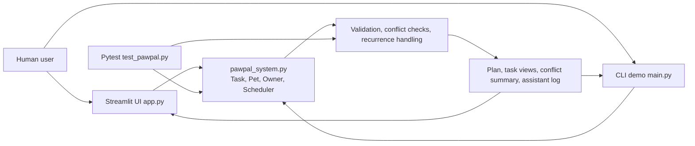
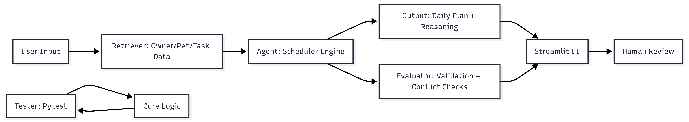

# PawPal+ System Diagram

At a glance:
- Main components: UI, CLI, core data models, scheduler engine, validation/conflict checks, and tests.
- Data flow: input -> processing in pawpal_system.py -> scheduled plan/report/output.
- This matches the current implementation: there is no database, retrieval layer, agent layer, or evaluator.

## Project Diagram

