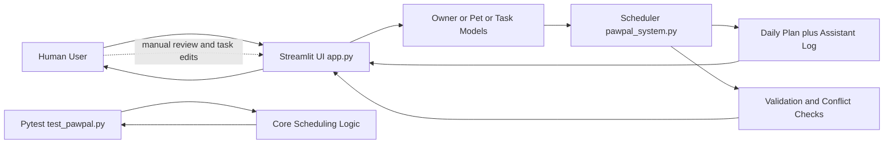

# PawPal+ System Diagram

At a glance:
- Main components: UI, model layer, scheduler engine, validator/conflict checker, and tests.
- Data flow: input -> process -> output follows user/task input -> scheduler -> plan/report shown back to the user.
- Human and testing checks: user reviews and edits results in UI; pytest verifies scheduling behavior automatically.

## Project Diagram

